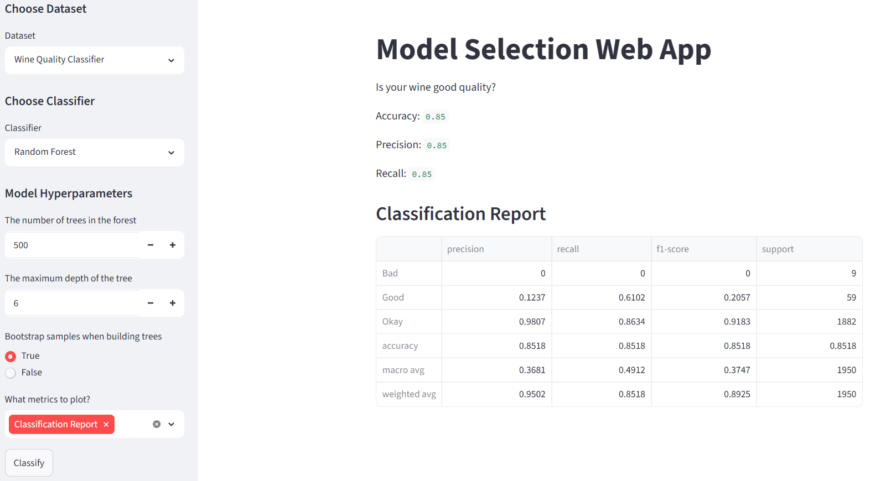
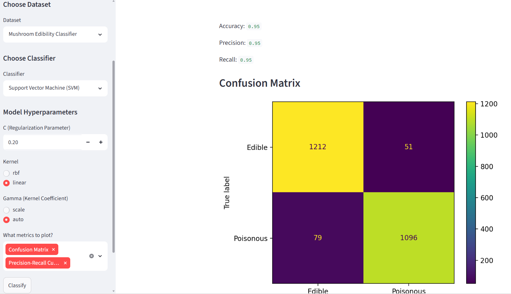
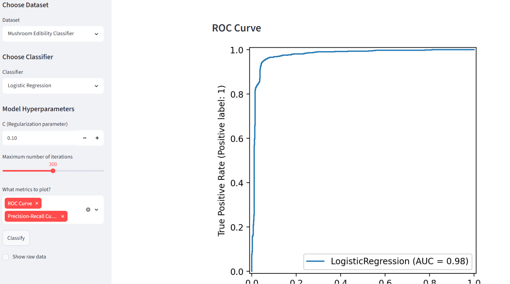

# Machine Learning Model Selection Web App

## Overview

This web application allows users to experiment with different machine learning classification models without writing code. Users can select from multiple datasets, configure model hyperparameters, choose evaluation metrics, and compare model performance through an interactive interface.

It is built using Streamlit and Scikit-learn and is designed for educational use and rapid experimentation with classification models.

---

## Features

- Select between two datasets
- Choose from multiple classification models
- Configure model hyperparameters
- Select evaluation metrics
- Train and evaluate models with a single button
- Display model performance results through selected metrics
- Simple and intuitive user interface

---

## Technologies Used

- Python
- Streamlit
- Scikit-learn
- Pandas
- Matplotlib

---

## Installation

### Prerequisites

### Clone the Repository

```bash
git clone https://github.com/Rpeoples05/Model-Selection-Web-App.git
cd Model-Selection-Web-App
```

### Install Dependencies

```bash
pip install -r requirements.txt
```

### Run the Application

```bash
streamlit run app.py
```

---

## How to Use

1. Launch the application.
2. Select one of the available datasets.
3. Choose a classification model.
4. Configure the model hyperparameters.
5. Select the evaluation metrics you wish to display.
6. Click the **Classify** button.
7. Review the generated performance metrics.

---

## Available Datasets

| Dataset | Description |
|----------|-------------|
| Wine Quality Dataset | 3 classes, 11 features (UCI Machine Learning Repository)|
| Mushroom Edibility Dataset | 2 classes, 23 features, (UCI Machine Learning Repository)|

---

## Available Models

| Model | Description |
|--------|-------------|
| Logistic Regression | Linear classification algorithm |
| Random Forest | Ensemble learning classifier |
| Support Vector Machine | Maximum-margin classifier |

---

## Hyperparameters

| Model | Hyperparameters |
|--------|-----------------|
| Logistic Regression | C, n_iterations |
| Random Forest | n_estimators, max_depth, bootstrap |
| SVM | C, kernel, gamma |

---

## Evaluation Metrics

- Accuracy (Default)
- Precision (Default)
- Recall (Default)
- Confusion Matrix
- ROC Curve
- Precision-Recall Curve
- Classification Report

---

## Limitations

- ROC Curve and Precision Recall are only available for binary classification problems
- Only supports two datasets
- Only supports classification tasks
- Limited hyperparameter tuning

---

## Future Improvements

- Use a OvR ROC Curve and Precision-Recall Curve so they can be used for tasks which are not binary
- More machine learning algorithms
- Recommended Hyperparameter Changes
- More datasets
- Feature Importance Plots

---

## Screenshots

### Example 1


### Example 2


### Example 3


## Author

**Name:** Ryan Peoples

GitHub: https://github.com/Rpeoples05

LinkedIn: https://linkedin.com/in/ryan-peoples-1163243aa

---

## Licence

This project is licensed under the MIT License.

